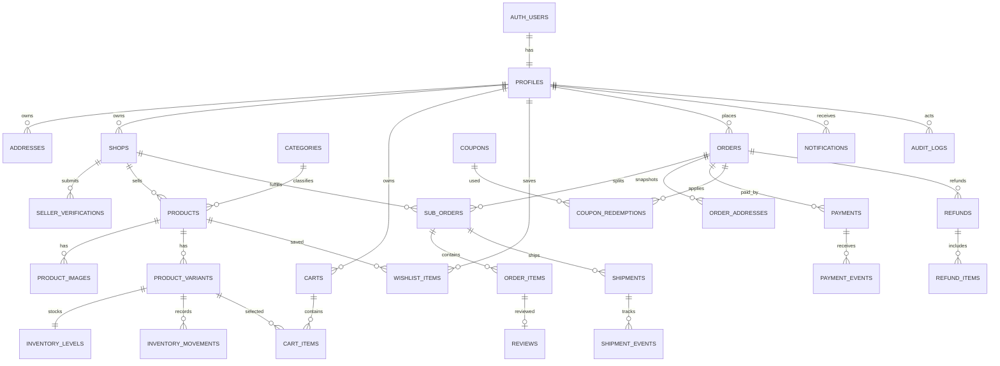

# SKYMART Database Design

> เอกสารออกแบบฐานข้อมูลสำหรับ SKYMART บน Supabase (PostgreSQL)  
> อ้างอิงจาก `PRD.md` เวอร์ชันปัจจุบันและ UI Buyer Flow ที่พัฒนาแล้ว  
> สถานะ: Design Proposal — ยังไม่ได้สร้าง Migration หรือเชื่อมต่อฐานข้อมูลจริง

## 1. เป้าหมายของการออกแบบ

ฐานข้อมูลนี้ออกแบบเพื่อรองรับ Marketplace ที่มีผู้ขายหลายร้าน โดยครอบคลุม:

- Authentication, Profile และ Address
- User คนเดียวเป็นผู้ซื้อและเจ้าของร้านได้
- Admin ดูแลผู้ใช้ ร้าน สินค้า คำสั่งซื้อ Payment และเนื้อหา
- ร้านค้า การสมัครเป็นผู้ขาย และการตรวจสอบเอกสาร
- สินค้า หมวดหมู่ รูปภาพ Variant/SKU และ Inventory
- Cart, Wishlist และ Checkout
- Parent Order ที่แยกเป็น Sub-order ตามร้านค้า
- Payment, Webhook, Refund และ Reconciliation
- Shipment และประวัติสถานะ
- Coupon/Promotion
- Review ที่อ้างอิงการซื้อจริง
- Notification และ Audit log
- Supabase Row Level Security (RLS) เพื่อป้องกันข้อมูลข้ามผู้ใช้และข้ามร้าน

หลักสำคัญคือข้อมูลด้านราคา การชำระเงิน สต็อก และสถานะคำสั่งซื้อ ต้องเชื่อถือข้อมูลจาก Server/Database เท่านั้น ไม่เชื่อค่าที่ส่งมาจาก Browser โดยตรง

---

## 2. เทคโนโลยีและมาตรฐานข้อมูล

| หัวข้อ | แนวทาง |
|---|---|
| Database | PostgreSQL ที่ให้บริการผ่าน Supabase |
| Authentication | Supabase Auth (`auth.users`) |
| Primary key | `uuid` และสร้างด้วย `gen_random_uuid()` |
| เวลา | `timestamptz` เก็บเป็น UTC และแปลงเขตเวลาเมื่อแสดงผล |
| เงิน | `bigint` หน่วยสตางค์ เช่น 2,990 บาท = `299000` เพื่อเลี่ยงความคลาดเคลื่อนของเลขทศนิยม |
| สกุลเงิน | `char(3)` ตาม ISO 4217 ค่าเริ่มต้น `THB` |
| จำนวนสินค้า | `integer` และต้องไม่ติดลบ |
| ข้อมูลยืดหยุ่น | ใช้ `jsonb` เฉพาะ snapshot, provider payload และ attributes ที่โครงสร้างเปลี่ยนได้ |
| Soft delete | ใช้ `deleted_at` หรือสถานะ แทนการลบข้อมูลธุรกรรมจริง |
| Naming | ตารางและคอลัมน์ใช้ `snake_case`, ชื่อตารางเป็นพหูพจน์ |
| Security | เปิด RLS ทุกตารางที่ Client เข้าถึงได้ |

### เหตุผลที่เก็บเงินเป็นสตางค์

ไม่ควรใช้ `float` กับจำนวนเงิน เพราะการคำนวณเลขทศนิยมของคอมพิวเตอร์อาจเกิดค่าคลาดเคลื่อน เช่นผลรวมอาจกลายเป็น `2990.0000001` การเก็บเป็นจำนวนเต็มหน่วยสตางค์ทำให้ Cart, Payment และ Order ตรงกันเสมอ

---

## 3. ภาพรวมความสัมพันธ์



---

## 4. ENUM และสถานะมาตรฐาน

PostgreSQL ENUM ช่วยจำกัดค่าไม่ให้สะกดผิด แต่การเพิ่มค่าใหม่ต้องผ่าน Migration หากสถานะมีแนวโน้มเปลี่ยนบ่อยสามารถเปลี่ยนเป็น lookup table ภายหลังได้

### 4.1 User และ Seller

```text
app_role              = USER | ADMIN
account_status        = ACTIVE | SUSPENDED | DEACTIVATED
shop_status           = DRAFT | PENDING_REVIEW | ACTIVE | REJECTED | SUSPENDED
verification_status   = DRAFT | SUBMITTED | APPROVED | REJECTED
```

บัญชีผู้ขายยังคงมี Role เป็น `USER` การเป็นผู้ขายพิจารณาจากการเป็นเจ้าของ `shops` ที่มีสถานะอนุมัติแล้ว ไม่ควรเพิ่ม Role `SELLER` เพราะขัดกับ Requirement ที่มีเพียง User และ Admin

### 4.2 Product

```text
product_status        = DRAFT | PENDING_REVIEW | ACTIVE | REJECTED | SUSPENDED | ARCHIVED
inventory_event_type  = INITIAL | RESTOCK | RESERVE | RELEASE | SALE | RETURN | ADJUSTMENT
```

### 4.3 Order

```text
order_status =
  PENDING_PAYMENT |
  PAYMENT_FAILED |
  PAID |
  PROCESSING |
  SHIPPED |
  DELIVERED |
  COMPLETED |
  CANCELLED |
  RETURN_REQUESTED |
  RETURNING |
  REFUND_PENDING |
  REFUNDED |
  PARTIALLY_REFUNDED
```

Parent Order ใช้สถานะสรุปรวม ส่วน Sub-order มีสถานะของแต่ละร้านแยกกัน เช่น ร้าน A ส่งแล้ว แต่ร้าน B ยังกำลังเตรียมสินค้า

### 4.4 Payment และ Refund

```text
payment_status = CREATED | PENDING | AUTHORIZED | SUCCEEDED | FAILED | CANCELLED | EXPIRED
refund_status  = REQUESTED | REVIEWING | APPROVED | PROCESSING | SUCCEEDED | FAILED | REJECTED
payment_method = PROMPTPAY | CARD | BANK_TRANSFER | OTHER
```

### 4.5 Shipment, Promotion และ Review

```text
shipment_status    = PENDING | READY_TO_SHIP | IN_TRANSIT | DELIVERED | FAILED | RETURNED
discount_type      = FIXED_AMOUNT | PERCENTAGE | FREE_SHIPPING
coupon_owner_type  = PLATFORM | SHOP
review_status      = PUBLISHED | HIDDEN | REMOVED
notification_type  = ORDER | PAYMENT | SHIPPING | PROMOTION | SYSTEM
```

---

## 5. รายละเอียดตาราง

ทุกตารางหลักควรมี `created_at timestamptz not null default now()` และตารางที่แก้ไขได้ควรมี `updated_at timestamptz not null default now()` พร้อม Trigger อัปเดตเวลาอัตโนมัติ

### 5.1 Identity และ Account

#### `profiles`

ข้อมูลผู้ใช้งานที่ต่อยอดจาก `auth.users`

| Column | Type | Constraint / ความหมาย |
|---|---|---|
| `id` | uuid | PK และ FK → `auth.users.id` |
| `role` | app_role | ค่าเริ่มต้น `USER`; ห้าม Client เปลี่ยนเอง |
| `status` | account_status | ค่าเริ่มต้น `ACTIVE` |
| `display_name` | text | ชื่อที่แสดงในระบบ |
| `first_name` | text | ชื่อจริง |
| `last_name` | text | นามสกุล |
| `phone` | text | เบอร์โทร ควรเก็บรูปแบบมาตรฐาน |
| `avatar_path` | text | path ใน Supabase Storage |
| `date_of_birth` | date | nullable |
| `suspended_at` | timestamptz | เวลาระงับบัญชี |
| `suspension_reason` | text | เหตุผลที่ Admin ระงับ |
| `last_login_at` | timestamptz | ใช้สำหรับ Security/Admin |

หมายเหตุ: Email และข้อมูลยืนยันตัวตนหลักอยู่ใน `auth.users` ไม่ควรคัดลอก password หรือ password hash มาที่ `profiles`

#### `addresses`

| Column | Type | Constraint / ความหมาย |
|---|---|---|
| `id` | uuid | PK |
| `user_id` | uuid | FK → `profiles.id` |
| `label` | text | เช่น บ้าน, ที่ทำงาน |
| `recipient_name` | text | ผู้รับสินค้า |
| `phone` | text | เบอร์ติดต่อผู้รับ |
| `address_line_1` | text | บ้านเลขที่/ถนน |
| `address_line_2` | text | รายละเอียดเพิ่มเติม nullable |
| `subdistrict` | text | แขวง/ตำบล |
| `district` | text | เขต/อำเภอ |
| `province` | text | จังหวัด |
| `postal_code` | varchar(10) | รหัสไปรษณีย์ |
| `country_code` | char(2) | ค่าเริ่มต้น `TH` |
| `is_default_shipping` | boolean | ที่อยู่จัดส่งหลัก |
| `is_default_billing` | boolean | ที่อยู่ออกเอกสารหลัก |
| `deleted_at` | timestamptz | Soft delete |

ควรมี unique partial index เพื่อให้ผู้ใช้มี Default Address แต่ละประเภทได้เพียงหนึ่งรายการ

---

### 5.2 Shop และ Seller Onboarding

#### `shops`

| Column | Type | Constraint / ความหมาย |
|---|---|---|
| `id` | uuid | PK |
| `owner_id` | uuid | FK → `profiles.id` |
| `slug` | text | unique, ใช้ใน URL |
| `name` | text | ชื่อร้าน |
| `description` | text | รายละเอียดร้าน |
| `logo_path` | text | Storage path |
| `cover_path` | text | Storage path |
| `status` | shop_status | สถานะร้าน |
| `rating_average` | numeric(3,2) | Cache สำหรับแสดงผล |
| `rating_count` | integer | จำนวนคะแนน |
| `commission_rate_bps` | integer | ค่าคอมมิชชัน basis points; 1000 = 10% |
| `approved_at` | timestamptz | เวลาที่อนุมัติ |
| `approved_by` | uuid | FK → `profiles.id`, Admin |
| `rejection_reason` | text | nullable |
| `suspended_at` | timestamptz | nullable |
| `suspension_reason` | text | nullable |

MVP อาจกำหนดหนึ่ง User ต่อหนึ่งร้านด้วย `unique(owner_id)` หากอนาคตรองรับหลายร้าน ให้ถอด constraint นี้โดยไม่ต้องเปลี่ยนความสัมพันธ์หลัก

#### `shop_members`

ตารางเผื่ออนาคตสำหรับพนักงานร้าน แม้ MVP จะใช้เจ้าของร้านเพียงคนเดียว

| Column | Type | ความหมาย |
|---|---|---|
| `shop_id` | uuid | FK → `shops.id` |
| `user_id` | uuid | FK → `profiles.id` |
| `member_role` | text | `OWNER`, `MANAGER`, `STAFF` |
| `permissions` | jsonb | สิทธิ์ย่อยในอนาคต |
| `status` | text | `ACTIVE`, `INVITED`, `REVOKED` |

PK แบบ composite: `(shop_id, user_id)`

#### `seller_verifications`

| Column | Type | ความหมาย |
|---|---|---|
| `id` | uuid | PK |
| `shop_id` | uuid | FK → `shops.id` |
| `status` | verification_status | สถานะการตรวจสอบ |
| `legal_name` | text | ชื่อบุคคล/นิติบุคคล |
| `business_type` | text | บุคคลธรรมดา/บริษัท |
| `tax_id_encrypted` | text | เลขภาษีที่เข้ารหัสหรือ Tokenized |
| `submitted_at` | timestamptz | เวลาส่งตรวจ |
| `reviewed_at` | timestamptz | เวลาตรวจ |
| `reviewed_by` | uuid | Admin ผู้ตรวจ |
| `review_note` | text | เหตุผลอนุมัติ/ปฏิเสธ |

#### `seller_documents`

เก็บ metadata ของเอกสารจริง โดยไฟล์อยู่ใน Private Storage Bucket

| Column | Type | ความหมาย |
|---|---|---|
| `id` | uuid | PK |
| `verification_id` | uuid | FK → `seller_verifications.id` |
| `document_type` | text | ประเภทเอกสาร |
| `storage_path` | text | path ใน private bucket |
| `file_hash` | text | ตรวจไฟล์ซ้ำ/ความสมบูรณ์ |
| `uploaded_by` | uuid | User ผู้ส่ง |

---

### 5.3 Catalog

#### `categories`

| Column | Type | ความหมาย |
|---|---|---|
| `id` | uuid | PK |
| `parent_id` | uuid | Self FK → `categories.id`, nullable |
| `slug` | text | unique |
| `name` | text | ชื่อหมวด |
| `description` | text | nullable |
| `image_path` | text | nullable |
| `sort_order` | integer | ลำดับแสดงผล |
| `is_active` | boolean | เปิด/ปิดหมวด |

`parent_id` ทำให้รองรับหมวดหลายระดับ เช่น แฟชั่น → รองเท้า → รองเท้าผู้ชาย

#### `products`

| Column | Type | ความหมาย |
|---|---|---|
| `id` | uuid | PK |
| `shop_id` | uuid | FK → `shops.id` |
| `category_id` | uuid | FK → `categories.id` |
| `slug` | text | unique |
| `name` | text | ชื่อเต็ม |
| `short_name` | text | ชื่อย่อสำหรับ Card |
| `description` | text | รายละเอียด |
| `status` | product_status | สถานะเผยแพร่/ตรวจสอบ |
| `brand` | text | nullable |
| `specifications` | jsonb | รายละเอียดที่ต่างกันตามหมวด |
| `rating_average` | numeric(3,2) | Cache จาก Review |
| `rating_count` | integer | Cache จำนวน Review |
| `sold_count` | integer | Cache จำนวนขาย |
| `moderation_note` | text | เหตุผล Reject/Suspend |
| `published_at` | timestamptz | nullable |
| `deleted_at` | timestamptz | Soft delete |

ราคาจริงและสต็อกไม่ควรอยู่ที่ Product เพราะสินค้าเดียวอาจมีหลายสี/ขนาดและแต่ละ Variant มีราคาหรือสต็อกต่างกัน

#### `product_images`

| Column | Type | ความหมาย |
|---|---|---|
| `id` | uuid | PK |
| `product_id` | uuid | FK → `products.id` |
| `variant_id` | uuid | FK → `product_variants.id`, nullable |
| `storage_path` | text | path รูปภาพ |
| `alt_text` | text | คำอธิบายเพื่อ Accessibility |
| `sort_order` | integer | ลำดับรูป |
| `is_primary` | boolean | รูปหลัก |

#### `product_variants`

| Column | Type | ความหมาย |
|---|---|---|
| `id` | uuid | PK |
| `product_id` | uuid | FK → `products.id` |
| `sku` | text | unique, รหัสจัดการสต็อก |
| `name` | text | เช่น Graphite / 42 |
| `attributes` | jsonb | เช่น `{ "color": "Graphite", "size": "42" }` |
| `price_amount` | bigint | ราคาขายหน่วยสตางค์ |
| `compare_at_amount` | bigint | ราคาเปรียบเทียบ nullable |
| `cost_amount` | bigint | ต้นทุน; จำกัดสิทธิ์ Seller/Admin |
| `currency` | char(3) | ค่าเริ่มต้น `THB` |
| `weight_grams` | integer | ใช้คำนวณขนส่ง |
| `is_active` | boolean | เปิดขายหรือไม่ |
| `version` | integer | Optimistic concurrency |

Constraints สำคัญ:

- `price_amount >= 0`
- `compare_at_amount is null or compare_at_amount >= price_amount`
- `weight_grams is null or weight_grams >= 0`

#### `inventory_levels`

หนึ่งแถวต่อ Variant ใน MVP หากมีหลายคลังในอนาคต ให้เพิ่ม `warehouse_id`

| Column | Type | ความหมาย |
|---|---|---|
| `variant_id` | uuid | PK/FK → `product_variants.id` |
| `on_hand` | integer | จำนวนที่มีจริง |
| `reserved` | integer | จำนวนที่กันไว้รอชำระ |
| `sold` | integer | จำนวนขายสะสม |
| `low_stock_threshold` | integer | จุดแจ้งเตือน |
| `version` | integer | ป้องกันการเขียนทับพร้อมกัน |

จำนวนที่ขายได้คำนวณจาก `available = on_hand - reserved` และต้องไม่ต่ำกว่า 0

#### `inventory_movements`

Ledger หรือสมุดรายการเปลี่ยนแปลงสต็อก ห้ามแก้ย้อนหลังตามปกติ

| Column | Type | ความหมาย |
|---|---|---|
| `id` | uuid | PK |
| `variant_id` | uuid | FK |
| `event_type` | inventory_event_type | สาเหตุ |
| `quantity_delta` | integer | จำนวนบวก/ลบ |
| `balance_after` | integer | ยอดหลังรายการ |
| `reference_type` | text | เช่น ORDER, REFUND, ADMIN |
| `reference_id` | uuid | ID เอกสารต้นทาง |
| `reason` | text | เหตุผล |
| `created_by` | uuid | User/Admin/System nullable |

#### `stock_reservations`

| Column | Type | ความหมาย |
|---|---|---|
| `id` | uuid | PK |
| `variant_id` | uuid | FK |
| `order_item_id` | uuid | FK → `order_items.id` |
| `quantity` | integer | จำนวนที่กัน |
| `status` | text | `ACTIVE`, `CONSUMED`, `RELEASED`, `EXPIRED` |
| `expires_at` | timestamptz | เวลาหมดอายุ |
| `released_at` | timestamptz | nullable |

---

### 5.4 Cart และ Wishlist

#### `carts`

| Column | Type | ความหมาย |
|---|---|---|
| `id` | uuid | PK |
| `user_id` | uuid | FK → `profiles.id` |
| `status` | text | `ACTIVE`, `CONVERTED`, `ABANDONED` |
| `currency` | char(3) | `THB` |
| `converted_order_id` | uuid | nullable |
| `expires_at` | timestamptz | nullable |

MVP แนะนำให้ Guest Cart อยู่ใน Local Storage และ merge เข้าตะกร้า User หลัง Login เพื่อไม่ต้องเปิดสิทธิ์เขียน Cart แบบสาธารณะในฐานข้อมูล

#### `cart_items`

| Column | Type | ความหมาย |
|---|---|---|
| `id` | uuid | PK |
| `cart_id` | uuid | FK → `carts.id` |
| `variant_id` | uuid | FK → `product_variants.id` |
| `quantity` | integer | `1..99` |
| `is_selected` | boolean | เลือก Checkout หรือไม่ |

Unique: `(cart_id, variant_id)` เพื่อไม่ให้ Variant เดียวกันซ้ำหลายแถว

ราคาใน Cart ควรอ่านจาก Variant ล่าสุดเสมอ และตรวจใหม่ตอน Checkout เพราะราคาอาจเปลี่ยนหลังจากเพิ่มสินค้า

#### `wishlist_items`

| Column | Type | ความหมาย |
|---|---|---|
| `user_id` | uuid | FK → `profiles.id` |
| `product_id` | uuid | FK → `products.id` |
| `created_at` | timestamptz | เวลาที่บันทึก |

PK: `(user_id, product_id)`

---

### 5.5 Order และ Multi-seller Checkout

#### `orders`

Parent Order สำหรับ Checkout หนึ่งครั้ง

| Column | Type | ความหมาย |
|---|---|---|
| `id` | uuid | PK |
| `order_number` | text | unique, รหัสที่แสดงให้ลูกค้า |
| `buyer_id` | uuid | FK → `profiles.id` |
| `status` | order_status | สถานะรวม |
| `currency` | char(3) | `THB` |
| `items_subtotal_amount` | bigint | ยอดสินค้าก่อนส่วนลด |
| `discount_amount` | bigint | ส่วนลดรวม |
| `shipping_amount` | bigint | ค่าจัดส่งรวม |
| `tax_amount` | bigint | ภาษี nullable/ค่าเริ่มต้น 0 |
| `grand_total_amount` | bigint | ยอดชำระสุทธิ |
| `payment_status` | payment_status | Cache เพื่อ Query เร็ว |
| `placed_at` | timestamptz | เวลายืนยัน Order |
| `paid_at` | timestamptz | nullable |
| `cancelled_at` | timestamptz | nullable |
| `completed_at` | timestamptz | nullable |
| `idempotency_key` | text | unique, ป้องกันกดสั่งซ้ำ |

Constraint ตรวจยอด:

```text
grand_total_amount = items_subtotal_amount - discount_amount + shipping_amount + tax_amount
```

#### `sub_orders`

หนึ่ง Parent Order แยกเป็นหนึ่ง Sub-order ต่อร้าน

| Column | Type | ความหมาย |
|---|---|---|
| `id` | uuid | PK |
| `order_id` | uuid | FK → `orders.id` |
| `shop_id` | uuid | FK → `shops.id` |
| `sub_order_number` | text | unique |
| `status` | order_status | สถานะของร้านนั้น |
| `items_subtotal_amount` | bigint | ยอดสินค้าร้านนี้ |
| `discount_amount` | bigint | ส่วนลดร้านนี้ |
| `shipping_amount` | bigint | ค่าจัดส่งร้านนี้ |
| `grand_total_amount` | bigint | ยอดสุทธิร้านนี้ |
| `seller_accept_by` | timestamptz | SLA ที่ต้องรับออเดอร์ |
| `accepted_at` | timestamptz | nullable |
| `cancel_reason` | text | nullable |

Unique: `(order_id, shop_id)` สำหรับ MVP ที่หนึ่งร้านมี Sub-order เดียวต่อ Checkout

#### `order_items`

ต้องเก็บ snapshot เพื่อให้ประวัติ Order ไม่เปลี่ยนตาม Product ปัจจุบัน

| Column | Type | ความหมาย |
|---|---|---|
| `id` | uuid | PK |
| `order_id` | uuid | FK → `orders.id` |
| `sub_order_id` | uuid | FK → `sub_orders.id` |
| `product_id` | uuid | FK, nullable เพื่อคงประวัติแม้ Product ถูกลบ |
| `variant_id` | uuid | FK, nullable |
| `shop_id` | uuid | FK |
| `product_name_snapshot` | text | ชื่อ ณ เวลาซื้อ |
| `sku_snapshot` | text | SKU ณ เวลาซื้อ |
| `variant_snapshot` | jsonb | สี/ขนาด ณ เวลาซื้อ |
| `image_path_snapshot` | text | รูป ณ เวลาซื้อ |
| `seller_name_snapshot` | text | ชื่อร้าน ณ เวลาซื้อ |
| `unit_price_amount` | bigint | ราคาต่อชิ้น |
| `quantity` | integer | จำนวน |
| `discount_amount` | bigint | ส่วนลดรายการ |
| `line_total_amount` | bigint | ยอดสุทธิรายการ |
| `fulfillment_status` | order_status | สถานะสินค้า |

#### `order_addresses`

Snapshot ที่อยู่ เพราะผู้ใช้แก้ Address Book ภายหลังได้

| Column | Type | ความหมาย |
|---|---|---|
| `id` | uuid | PK |
| `order_id` | uuid | FK |
| `address_type` | text | `SHIPPING` หรือ `BILLING` |
| `recipient_name` | text | Snapshot |
| `phone` | text | Snapshot |
| `address_line_1` | text | Snapshot |
| `address_line_2` | text | Snapshot |
| `subdistrict` | text | Snapshot |
| `district` | text | Snapshot |
| `province` | text | Snapshot |
| `postal_code` | text | Snapshot |
| `country_code` | char(2) | Snapshot |

#### `order_status_history`

| Column | Type | ความหมาย |
|---|---|---|
| `id` | uuid | PK |
| `order_id` | uuid | Parent Order nullable |
| `sub_order_id` | uuid | Sub-order nullable |
| `from_status` | order_status | nullable สำหรับสถานะแรก |
| `to_status` | order_status | สถานะใหม่ |
| `actor_id` | uuid | User/Admin nullable หาก System |
| `actor_type` | text | `BUYER`, `SELLER`, `ADMIN`, `SYSTEM`, `PROVIDER` |
| `reason` | text | บังคับเมื่อ Cancel/Refund/Admin override |
| `metadata` | jsonb | ข้อมูลประกอบ |

ควรมี Check Constraint ว่าต้องมี `order_id` หรือ `sub_order_id` อย่างน้อยหนึ่งค่า

---

### 5.6 Payment และ Webhook

#### `payments`

| Column | Type | ความหมาย |
|---|---|---|
| `id` | uuid | PK |
| `order_id` | uuid | FK → `orders.id` |
| `attempt_number` | integer | ครั้งที่พยายามจ่าย |
| `provider` | text | ชื่อ Payment Provider |
| `method` | payment_method | ช่องทาง |
| `status` | payment_status | สถานะ |
| `amount` | bigint | ยอดที่ขอชำระ |
| `currency` | char(3) | `THB` |
| `provider_payment_id` | text | unique เมื่อมีค่า |
| `idempotency_key` | text | unique |
| `checkout_url` | text | Hosted payment URL nullable |
| `expires_at` | timestamptz | เวลาหมดอายุ |
| `paid_at` | timestamptz | nullable |
| `failure_code` | text | nullable |
| `failure_message` | text | ข้อความภายใน ไม่แสดงตรง ๆ ให้ User |

หนึ่ง Order อาจมี Payment หลาย attempt แต่มีรายการสำเร็จได้ตามยอดที่ระบบอนุญาตเท่านั้น

#### `payment_events`

เก็บทุก Webhook เพื่อรองรับ retry, idempotency และการตรวจย้อนหลัง

| Column | Type | ความหมาย |
|---|---|---|
| `id` | uuid | PK |
| `payment_id` | uuid | FK nullable หากยังจับคู่ไม่ได้ |
| `provider` | text | Provider |
| `provider_event_id` | text | unique ต่อ Provider |
| `event_type` | text | ประเภท event |
| `signature_verified` | boolean | ผ่านการตรวจลายเซ็นหรือไม่ |
| `payload` | jsonb | Raw payload ที่ตัดข้อมูลอ่อนไหวแล้ว |
| `processing_status` | text | `RECEIVED`, `PROCESSED`, `IGNORED`, `FAILED` |
| `processed_at` | timestamptz | nullable |
| `error_message` | text | nullable |

Unique: `(provider, provider_event_id)` ทำให้ Provider ส่ง Webhook ซ้ำแล้วไม่สร้างผลลัพธ์ซ้ำ

#### `payment_reconciliations`

| Column | Type | ความหมาย |
|---|---|---|
| `id` | uuid | PK |
| `payment_id` | uuid | FK |
| `provider_amount` | bigint | ยอดจาก Provider |
| `system_amount` | bigint | ยอดในระบบ |
| `provider_status` | text | สถานะจาก Provider |
| `system_status` | payment_status | สถานะในระบบ |
| `result` | text | `MATCHED`, `MISMATCH`, `MISSING` |
| `checked_at` | timestamptz | เวลาตรวจ |
| `resolved_at` | timestamptz | nullable |
| `resolved_by` | uuid | Admin nullable |
| `resolution_note` | text | nullable |

---

### 5.7 Shipment

#### `shipments`

| Column | Type | ความหมาย |
|---|---|---|
| `id` | uuid | PK |
| `sub_order_id` | uuid | FK → `sub_orders.id` |
| `provider` | text | ผู้ให้บริการขนส่ง |
| `service_level` | text | Standard/Next-day |
| `tracking_number` | text | unique ต่อ Provider |
| `status` | shipment_status | สถานะล่าสุด |
| `shipping_fee_amount` | bigint | ค่าขนส่ง |
| `label_path` | text | Private Storage path nullable |
| `shipped_at` | timestamptz | nullable |
| `delivered_at` | timestamptz | nullable |
| `estimated_delivery_at` | timestamptz | nullable |

#### `shipment_events`

| Column | Type | ความหมาย |
|---|---|---|
| `id` | uuid | PK |
| `shipment_id` | uuid | FK |
| `provider_event_id` | text | nullable/unique ต่อ Provider |
| `status` | shipment_status | สถานะในระบบ |
| `provider_status` | text | สถานะต้นฉบับ |
| `description` | text | ข้อความ Timeline |
| `location` | text | nullable |
| `occurred_at` | timestamptz | เวลาเหตุการณ์ |
| `payload` | jsonb | nullable |

---

### 5.8 Coupon และ Promotion

#### `coupons`

| Column | Type | ความหมาย |
|---|---|---|
| `id` | uuid | PK |
| `owner_type` | coupon_owner_type | Platform หรือ Shop |
| `shop_id` | uuid | nullable; ต้องมีเมื่อ owner เป็น SHOP |
| `code` | citext | unique แบบไม่สนตัวพิมพ์ |
| `name` | text | ชื่อโปรโมชัน |
| `discount_type` | discount_type | รูปแบบส่วนลด |
| `discount_value` | bigint | จำนวนสตางค์ หรือ basis points ตาม type |
| `max_discount_amount` | bigint | nullable สำหรับเปอร์เซ็นต์ |
| `minimum_spend_amount` | bigint | ยอดขั้นต่ำ |
| `total_quota` | integer | จำนวนสิทธิ์ทั้งหมด nullable |
| `per_user_limit` | integer | จำกัดต่อ User |
| `starts_at` | timestamptz | เวลาเริ่ม |
| `ends_at` | timestamptz | เวลาสิ้นสุด |
| `is_active` | boolean | เปิดใช้งาน |
| `stacking_policy` | jsonb | กฎใช้ร่วมกับ Coupon อื่น |

#### `coupon_products` และ `coupon_categories`

ตารางเชื่อม Scope ของ Coupon

```text
coupon_products(coupon_id, product_id)
coupon_categories(coupon_id, category_id)
```

ถ้าไม่มี Scope ถือว่าใช้ได้กับสินค้าทั้งหมดภายใต้เจ้าของ Coupon

#### `coupon_redemptions`

| Column | Type | ความหมาย |
|---|---|---|
| `id` | uuid | PK |
| `coupon_id` | uuid | FK |
| `user_id` | uuid | FK |
| `order_id` | uuid | FK |
| `discount_amount` | bigint | ส่วนลดจริง |
| `status` | text | `RESERVED`, `REDEEMED`, `RELEASED`, `REFUNDED` |
| `reserved_at` | timestamptz | nullable |
| `redeemed_at` | timestamptz | nullable |

Quota ต้องถูกจองและตัดใน Transaction เดียวกับ Checkout เพื่อป้องกันใช้เกินจำนวน

---

### 5.9 Review และ Rating

#### `reviews`

| Column | Type | ความหมาย |
|---|---|---|
| `id` | uuid | PK |
| `user_id` | uuid | FK → `profiles.id` |
| `product_id` | uuid | FK → `products.id` |
| `order_item_id` | uuid | FK → `order_items.id`, unique |
| `rating` | smallint | 1–5 |
| `title` | text | nullable |
| `content` | text | nullable |
| `status` | review_status | สถานะการแสดงผล |
| `is_verified_purchase` | boolean | true เมื่ออ้างอิง Order สำเร็จ |
| `hidden_reason` | text | nullable |
| `moderated_by` | uuid | Admin nullable |
| `moderated_at` | timestamptz | nullable |

Unique `order_item_id` ทำให้หนึ่งรายการซื้อรีวิวได้ครั้งเดียว ผู้ใช้รีวิวได้เมื่อเป็นเจ้าของ Order และสินค้าอยู่ในสถานะ Delivered/Completed เท่านั้น

#### `review_images`

```text
id, review_id, storage_path, sort_order, created_at
```

---

### 5.10 Return และ Refund

#### `return_requests`

| Column | Type | ความหมาย |
|---|---|---|
| `id` | uuid | PK |
| `sub_order_id` | uuid | FK |
| `requested_by` | uuid | Buyer |
| `reason_code` | text | เหตุผลมาตรฐาน |
| `reason_detail` | text | รายละเอียด |
| `status` | text | `REQUESTED`, `APPROVED`, `REJECTED`, `SHIPPING_BACK`, `RECEIVED`, `CLOSED` |
| `reviewed_by` | uuid | Seller/Admin nullable |
| `review_note` | text | nullable |
| `return_tracking_number` | text | nullable |

#### `return_items`

```text
id, return_request_id, order_item_id, quantity, condition_note, resolution
```

#### `refunds`

| Column | Type | ความหมาย |
|---|---|---|
| `id` | uuid | PK |
| `order_id` | uuid | FK |
| `sub_order_id` | uuid | FK nullable |
| `payment_id` | uuid | FK |
| `return_request_id` | uuid | FK nullable |
| `status` | refund_status | สถานะ |
| `amount` | bigint | ยอดคืน |
| `currency` | char(3) | `THB` |
| `reason` | text | เหตุผล |
| `provider_refund_id` | text | unique nullable |
| `idempotency_key` | text | unique |
| `requested_by` | uuid | User/Seller/Admin nullable |
| `approved_by` | uuid | Admin nullable |
| `processed_at` | timestamptz | nullable |

#### `refund_items`

```text
id, refund_id, order_item_id, quantity, amount
```

ยอด Refund รวมของ Order ต้องไม่เกินยอดที่ชำระสำเร็จ และทุกการเปลี่ยนสถานะต้องมีประวัติ/Audit

---

### 5.11 Notification, Content และ Audit

#### `notifications`

| Column | Type | ความหมาย |
|---|---|---|
| `id` | uuid | PK |
| `user_id` | uuid | FK |
| `type` | notification_type | ประเภท |
| `title` | text | หัวข้อ |
| `body` | text | เนื้อหา |
| `reference_type` | text | ORDER, PRODUCT, SHOP ฯลฯ |
| `reference_id` | uuid | ID ที่เกี่ยวข้อง |
| `action_url` | text | URL ภายในระบบ |
| `read_at` | timestamptz | nullable |

ต้องตรวจสิทธิ์ที่ปลายทางอีกครั้ง ห้ามถือว่าผู้ใช้เข้าถึงข้อมูลได้เพียงเพราะได้รับ Notification

#### `home_sections`

ให้ Admin จัดการ Banner/Section บนหน้าแรก

| Column | Type | ความหมาย |
|---|---|---|
| `id` | uuid | PK |
| `section_type` | text | `HERO`, `PRODUCT_LIST`, `CATEGORY_LIST`, `BANNER` |
| `title` | text | nullable |
| `content` | jsonb | Config ของ Section |
| `sort_order` | integer | ลำดับ |
| `starts_at` | timestamptz | nullable |
| `ends_at` | timestamptz | nullable |
| `is_active` | boolean | เปิดใช้งาน |
| `created_by` | uuid | Admin |

#### `audit_logs`

Append-only: ไม่ให้ Client update/delete

| Column | Type | ความหมาย |
|---|---|---|
| `id` | bigint generated identity | PK เรียงตามเวลา |
| `actor_id` | uuid | ผู้กระทำ nullable เมื่อ System |
| `actor_role` | app_role | Role ขณะทำรายการ |
| `action` | text | เช่น `PRODUCT_SUSPENDED` |
| `entity_type` | text | ตารางหรือ Domain |
| `entity_id` | text | รองรับ UUID/รหัสภายนอก |
| `before_data` | jsonb | ข้อมูลก่อนแก้; ต้อง mask PII |
| `after_data` | jsonb | ข้อมูลหลังแก้; ต้อง mask PII |
| `reason` | text | บังคับสำหรับ Admin action สำคัญ |
| `request_id` | uuid | ใช้ trace request |
| `ip_address` | inet | จำกัดการเข้าถึง |
| `user_agent` | text | nullable |
| `created_at` | timestamptz | เวลาเกิดเหตุการณ์ |

ไม่ควรเก็บ password, access token, เลขบัตรเต็ม หรือ Provider secret ใน Audit log

---

## 6. Row Level Security (RLS)

RLS คือกฎในฐานข้อมูลที่ตรวจว่าผู้ใช้แต่ละคนอ่านหรือแก้แถวใดได้ แม้มีคนเรียก Supabase API โดยไม่ผ่านหน้าเว็บ กฎนี้ยังทำงานอยู่

### 6.1 Helper Functions

ควรมี Security Definer Functions ที่เขียนอย่างระมัดระวัง:

```text
is_admin()                         ตรวจ role ของ auth.uid()
owns_shop(shop_id)                 ตรวจว่าเป็น owner/member ของร้าน
owns_order(order_id)               ตรวจว่าเป็น buyer ของ order
can_manage_sub_order(sub_order_id) ตรวจว่าร้านเป็นเจ้าของ sub-order
```

กำหนด `search_path` แบบคงที่ ปิดสิทธิ์ execute ที่ไม่จำเป็น และหลีกเลี่ยง Policy ที่เรียกตารางเดิมจนเกิด recursion

### 6.2 Policy Matrix

| ตาราง | Public/Guest | User | Seller context | Admin |
|---|---|---|---|---|
| `profiles` | ไม่อ่าน | อ่าน/แก้ของตน | เหมือน User | อ่านทั้งหมด; แก้สถานะผ่าน Server action |
| `addresses` | ไม่ได้ | CRUD ของตน | เหมือน User | อ่านเมื่อมีเหตุผลตามงาน Support |
| `shops` | อ่านเฉพาะ ACTIVE | อ่านทั้งหมดที่ ACTIVE | จัดการร้านของตน | จัดการทั้งหมด |
| `seller_verifications` | ไม่ได้ | อ่านของร้านตน | สร้าง/แก้ก่อน Submit | ตรวจและเปลี่ยนสถานะ |
| `products` | อ่าน ACTIVE | อ่าน ACTIVE | CRUD สินค้าร้านตน | อ่าน/Moderate ทั้งหมด |
| `product_variants` | อ่านเมื่อ Product ACTIVE | อ่าน | จัดการของร้านตน | ทั้งหมด |
| `inventory_levels` | อ่านเฉพาะ available ผ่าน View/RPC | อ่าน available | จัดการผ่าน RPC ของร้าน | ทั้งหมด |
| `carts`, `cart_items` | ไม่ใช้ DB สำหรับ Guest | CRUD ของตน | เหมือน User | ไม่จำเป็นต้องแก้ |
| `wishlist_items` | ไม่ได้ | CRUD ของตน | เหมือน User | ไม่จำเป็น |
| `orders` | ไม่ได้ | อ่าน Order ของตน | อ่านผ่าน Sub-order ของร้าน | อ่านทั้งหมด |
| `sub_orders`, `order_items` | ไม่ได้ | อ่านเมื่อ Parent เป็นของตน | อ่านเฉพาะร้านตน | ทั้งหมด |
| `payments` | ไม่ได้ | อ่านแบบ mask เฉพาะ Order ตน | ไม่เห็นข้อมูลลับ Provider | ทั้งหมดตามสิทธิ์ Finance |
| `payment_events` | ไม่ได้ | ไม่ได้ | ไม่ได้ | อ่านเท่านั้น; เขียนผ่าน Service Role |
| `shipments` | ไม่ได้ | อ่านของ Order ตน | จัดการของร้านตนตาม Transition | ทั้งหมด |
| `coupons` | อ่านที่ Active และอยู่ในช่วงเวลา | อ่าน/ใช้ผ่าน RPC | จัดการ Coupon ร้านตน | ทั้งหมด |
| `reviews` | อ่าน PUBLISHED | สร้าง/แก้ของตนตามกฎ | อ่าน Review สินค้าร้านตน | Moderate ทั้งหมด |
| `notifications` | ไม่ได้ | อ่าน/mark read ของตน | เหมือน User | ไม่อ่านข้อมูลส่วนตัวโดยไม่จำเป็น |
| `audit_logs` | ไม่ได้ | ไม่ได้ | ไม่ได้ | อ่าน; ห้าม update/delete |

### 6.3 สิ่งที่ห้ามให้ Client ทำโดยตรง

- เปลี่ยน `profiles.role`
- เปลี่ยนสถานะ Shop/Product เป็น Approved
- เขียนราคาที่ใช้สร้าง Order โดยไม่คำนวณใหม่ที่ Server
- ลดหรือคืนสต็อกด้วยการ update ตรง ๆ
- สร้าง Payment success
- ประมวลผล Webhook
- อนุมัติ Refund
- เขียน/แก้ Audit log

งานเหล่านี้ต้องผ่าน Server-side code, Supabase Edge Function หรือ PostgreSQL RPC ที่ตรวจสิทธิ์และทำ Transaction

---

## 7. Transaction สำคัญ

### 7.1 Checkout

ควรทำใน Database Transaction เดียว:

1. Lock Variant ที่กำลังซื้อ
2. ตรวจ Product/Shop/Variant ว่ายัง Active
3. ตรวจราคาล่าสุดและจำนวน available
4. ตรวจ Coupon และจอง quota
5. สร้าง Parent Order
6. สร้าง Sub-order แยกตาม Shop
7. สร้าง Order Items พร้อม snapshot
8. กันสต็อกและสร้าง Stock Reservation
9. สร้าง Payment attempt พร้อม idempotency key
10. Commit แล้วจึงเรียก Payment Provider

หากขั้นตอนใดล้มเหลว ต้อง rollback ทั้งหมดเพื่อไม่ให้มี Order ครึ่งหนึ่งหรือสต็อกหาย

### 7.2 Payment Success

1. รับ Webhook และบันทึก `payment_events`
2. ตรวจ signature
3. ตรวจว่า `provider_event_id` ยังไม่เคยประมวลผล
4. Lock Payment/Order
5. เปลี่ยน Payment เป็น `SUCCEEDED`
6. เปลี่ยน Order เป็น `PAID`
7. เปลี่ยน Stock Reservation เป็น `CONSUMED`
8. บันทึก Inventory Movement เป็น `SALE`
9. สร้าง Notification ให้ Buyer และ Seller
10. Mark event เป็น `PROCESSED`

### 7.3 Payment Failed/Expired

- เปลี่ยน Payment status
- Release Stock Reservation
- คืน Coupon Reservation
- บันทึก Inventory Movement `RELEASE`
- Order เป็น `PAYMENT_FAILED` หรือคงให้ retry ตาม policy

### 7.4 Order Status Transition

ควรมีฟังก์ชันกลางตรวจ Transition เช่น:

```text
PAID -> PROCESSING -> SHIPPED -> DELIVERED -> COMPLETED
PENDING_PAYMENT -> PAYMENT_FAILED
PAID/PROCESSING -> CANCELLED (เมื่อ Policy อนุญาต)
DELIVERED -> RETURN_REQUESTED -> RETURNING -> REFUND_PENDING -> REFUNDED
```

ห้าม Client ส่งสถานะปลายทางใดก็ได้โดยตรง ต้องตรวจ Actor, สถานะเดิม, SLA และเหตุผล

---

## 8. Index ที่แนะนำ

นอกจาก PK/Unique Index ควรมี:

```text
profiles(role, status)
addresses(user_id) WHERE deleted_at IS NULL
shops(owner_id, status)
shops(status, created_at DESC)
products(shop_id, status)
products(category_id, status, published_at DESC)
products USING gin(to_tsvector('simple', name || ' ' || description))
product_variants(product_id, is_active)
inventory_levels(variant_id)
inventory_movements(variant_id, created_at DESC)
carts(user_id, status)
cart_items(cart_id)
orders(buyer_id, created_at DESC)
orders(status, created_at DESC)
sub_orders(shop_id, status, created_at DESC)
order_items(order_id)
order_items(sub_order_id)
payments(order_id, created_at DESC)
payments(provider, provider_payment_id)
payment_events(provider, provider_event_id)
shipments(sub_order_id)
shipments(provider, tracking_number)
coupons(code) WHERE is_active = true
coupon_redemptions(user_id, coupon_id)
reviews(product_id, status, created_at DESC)
notifications(user_id, read_at, created_at DESC)
audit_logs(entity_type, entity_id, created_at DESC)
audit_logs(actor_id, created_at DESC)
```

Search ภาษาไทยควรเริ่มจาก PostgreSQL Full Text/`pg_trgm` สำหรับ MVP และประเมิน Search Engine ภายนอกเมื่อข้อมูลโตหรือจำเป็นต้องรองรับ typo/synonym ขั้นสูง

---

## 9. Database Views และ RPC ที่แนะนำ

### Views

| View | จุดประสงค์ |
|---|---|
| `public_product_catalog` | เปิดเฉพาะข้อมูล Product/Variant ที่ Public ดูได้ |
| `product_price_summary` | ราคาต่ำสุด–สูงสุดและ available stock |
| `shop_rating_summary` | คะแนนและจำนวน Review ต่อร้าน |
| `seller_order_queue` | งานที่ Seller ต้องทำ เรียงตาม SLA |
| `admin_dashboard_daily` | GMV, Order, Payment success, Refund และผู้ใช้ใหม่รายวัน |
| `payment_order_mismatches` | รายการที่ต้อง Reconcile |

### RPC / Database Functions

```text
create_checkout(...)
reserve_inventory(...)
release_expired_reservations()
apply_coupon(...)
process_payment_event(...)
transition_sub_order_status(...)
request_cancellation(...)
request_refund(...)
submit_review(...)
mark_notifications_read(...)
```

RPC ที่เกี่ยวกับเงินหรือสต็อกต้องตรวจ `auth.uid()`, ใช้ Transaction/row lock และคืน error code ที่ UI แปลงเป็นข้อความเข้าใจง่ายได้

---

## 10. Supabase Storage

| Bucket | Public | ใช้งาน | Policy |
|---|---:|---|---|
| `product-images` | ใช่ | รูปสินค้า | Seller upload เฉพาะ path ร้านตน; Public read เฉพาะสินค้าที่อนุญาต |
| `shop-assets` | ใช่ | Logo/Cover ร้าน | Owner upload, Public read |
| `avatars` | อาจเป็น Public | รูป Profile | User จัดการ path ของตน |
| `review-images` | ใช่ | รูปรีวิว | เจ้าของ Review upload; Admin moderate |
| `seller-documents` | ไม่ | เอกสารยืนยันผู้ขาย | Seller และ Admin ที่เกี่ยวข้องเท่านั้น |
| `shipping-labels` | ไม่ | ใบปะหน้า | Seller ของ Sub-order และ Admin |

อย่าเก็บ Public URL แบบถาวรสำหรับไฟล์ Private ให้เก็บ `storage_path` แล้วสร้าง Signed URL อายุสั้นเมื่อผู้มีสิทธิ์ร้องขอ

---

## 11. Security และ Privacy

- เปิด RLS ทุกตารางใน `public` schema
- Service Role Key ใช้เฉพาะ Server/Edge Function และห้ามส่งไป Browser
- ข้อมูลบัตรต้องอยู่กับ Hosted Payment Page/Tokenization ไม่เก็บเลขบัตรหรือ CVV
- เอกสารผู้ขายและ PII ใช้ Private Bucket และจำกัดสิทธิ์
- Mask เบอร์โทร ที่อยู่ Tax ID และข้อมูลส่วนบุคคลใน Admin UI ตามหน้าที่
- Admin action ที่สำคัญต้องระบุเหตุผลและเขียน Audit log
- Production Admin ควรบังคับ MFA
- Rate limit Login, OTP, Coupon, Search abuse และ Payment initiation
- Webhook ต้องตรวจ signature, timestamp และ idempotency
- Backup, Point-in-time Recovery และ Restore Drill ต้องกำหนดก่อน Go-live
- Order, Payment, Refund, Inventory Movement และ Audit log ห้าม Hard delete ผ่าน UI ปกติ

---

## 12. Data Retention

ระยะเวลาจริงต้องยืนยันกับฝ่ายกฎหมาย/บัญชี แต่เสนอแนวทางเริ่มต้น:

| ข้อมูล | แนวทาง |
|---|---|
| Profile ที่ปิดบัญชี | Anonymize PII เมื่อพ้นภาระผูกพัน แต่คง reference ธุรกรรม |
| Address Book | Soft delete; Order ใช้ Snapshot แยก |
| Cart ที่ไม่ใช้งาน | Archive/Delete หลัง 90–180 วัน |
| Payment Event | เก็บตามข้อกำหนด Provider/บัญชี โดย mask payload |
| Order/Refund | เก็บตามข้อกำหนดบัญชีและกฎหมาย |
| Audit Log | Append-only และกำหนด retention อย่างน้อยตามระยะตรวจสอบภายใน |
| Notification | ลบหรือ archive ตามอายุที่กำหนด เช่น 12 เดือน |

---

## 13. Migration Plan

### Phase 1 — Commerce MVP

1. ENUM, updated timestamp trigger และ helper functions
2. `profiles`, `addresses`
3. `shops`, `seller_verifications`, `seller_documents`
4. `categories`, `products`, `product_images`, `product_variants`
5. `inventory_levels`, `inventory_movements`, `stock_reservations`
6. `carts`, `cart_items`, `wishlist_items`
7. `orders`, `sub_orders`, `order_items`, `order_addresses`, `order_status_history`
8. `payments`, `payment_events`
9. `shipments`, `shipment_events`
10. `notifications`, `audit_logs`
11. RLS Policies, Storage Policies และ automated tests

### Phase 2 — Trust and Growth

1. Reviews และ review images
2. Coupons, scope และ redemption
3. Return requests และ Refunds
4. Home sections/Banners
5. Payment reconciliation views/jobs

### Phase 3 — Scale

1. หลายคลังสินค้า
2. Shop staff และ permission ย่อย
3. Settlement/Ledger สำหรับจ่ายเงินผู้ขาย
4. Partition ตาราง event/audit ขนาดใหญ่ตามเดือน
5. Search engine หรือ read replica เมื่อมีเหตุผลจากปริมาณใช้งานจริง

---

## 14. Seed Data สำหรับ UI ปัจจุบัน

ข้อมูลใน `lib/mock-data.ts` สามารถ map เข้าฐานข้อมูลดังนี้:

| UI ปัจจุบัน | Database |
|---|---|
| `Category` | `categories` |
| `Product.seller` | `shops.name` |
| `Product` | `products` |
| `Product.image/gallery` | `product_images` |
| `Product.colors` | `product_variants.attributes.color` |
| `Product.price` | `product_variants.price_amount` |
| `Product.stock` | `inventory_levels.on_hand` |
| `Product.specs` | `products.specifications` |
| `CartItem.productId/color` | `cart_items.variant_id` |

เมื่อ Seed ควรสร้าง UUID จริงและใช้ SKU ที่ชัดเจน เช่น:

```text
AERO-GRAPHITE
AERO-CLOUD
AERO-SKY
```

---

## 15. Open Decisions ก่อนสร้าง Production Migration

ต้องได้คำตอบจาก Stakeholder ก่อนล็อก Schema ด้านการเงิน:

1. หนึ่ง User เปิดได้กี่ร้าน?
2. ร้านและสินค้าต้องผ่าน Admin ทุกครั้งหรือมี Auto-approval?
3. Commission คิดจากยอดใดและรวม/ไม่รวมค่าจัดส่ง?
4. Coupon ร้านและ Coupon Platform ใช้ร่วมกันได้อย่างไร?
5. Shipping fee คำนวณต่อร้าน ต่อ Shipment หรือต่อ Parent Order?
6. Payment Provider และช่องทางแรกคืออะไร?
7. Payment timeout และ Stock reservation มีอายุกี่นาที?
8. Seller ต้อง Accept Order ภายในกี่ชั่วโมง?
9. ใครสร้าง Shipping label และ Tracking number?
10. Return window กี่วัน และใครรับผิดชอบค่าขนส่งคืน?
11. ใครมีสิทธิ์อนุมัติ Refund และต้องมีผู้อนุมัติสองคนหรือไม่?
12. ต้องรองรับ Partial shipment และ Partial refund ตั้งแต่ MVP หรือไม่?
13. ต้องออกใบกำกับภาษีหรือไม่ และเก็บข้อมูลนิติบุคคลระดับใด?
14. ระยะเวลาเก็บ PII, Payment event และ Audit log เท่าใด?

---

## 16. Acceptance Criteria ของฐานข้อมูล

ฐานข้อมูลพร้อมสำหรับเริ่ม Backend เมื่อผ่านเงื่อนไขต่อไปนี้:

- User A ไม่สามารถอ่านหรือแก้ Profile, Address, Cart, Wishlist และ Order ของ User B
- Seller A ไม่สามารถอ่านหรือแก้ Product, Inventory และ Sub-order ของ Seller B
- Public อ่านได้เฉพาะ Shop/Product/Variant/Review ที่อยู่ในสถานะเผยแพร่
- Admin action สำคัญมีเหตุผลและ Audit log
- Checkout เดียวสร้าง Parent Order หนึ่งรายการและ Sub-order ตามจำนวนร้าน
- Order Item เก็บชื่อ ราคา Variant ร้าน และรูปแบบ snapshot
- Cart, Checkout, Payment และ Order คำนวณยอดตรงกัน
- การกด Checkout ซ้ำไม่สร้าง Order ซ้ำ
- Webhook ซ้ำไม่ตัดสต็อกหรือเปลี่ยน Payment ซ้ำ
- สต็อกไม่ติดลบแม้มีการซื้อพร้อมกัน
- Payment ล้มเหลวหรือหมดอายุคืน Stock Reservation และ Coupon quota
- Review สร้างได้เฉพาะรายการที่ซื้อและได้รับสินค้าแล้ว
- Refund รวมไม่เกินยอด Payment ที่สำเร็จ
- Private files ไม่สามารถเปิดได้โดยไม่มี Signed URL และสิทธิ์ที่ถูกต้อง
- ตารางธุรกรรมสำคัญไม่มี Hard delete จาก Client

---

## 17. ขั้นตอนถัดไปที่แนะนำ

1. ยืนยัน Open Decisions โดยเฉพาะ Commission, Shipping, Refund และ Settlement
2. ตรวจ ERD ร่วมกับ Buyer, Seller, Admin/Operations และ Finance
3. สร้าง Migration ชุดแรกเฉพาะ Phase 1
4. เขียน RLS Policy tests ก่อนเชื่อม UI
5. สร้าง Seed script จาก `lib/mock-data.ts`
6. Generate TypeScript types จาก Supabase schema
7. เชื่อมระบบทีละ Domain เริ่มจาก Auth → Catalog → Cart → Checkout
8. เชื่อม Payment ใน Sandbox หลัง Transaction และ Idempotency tests ผ่าน

